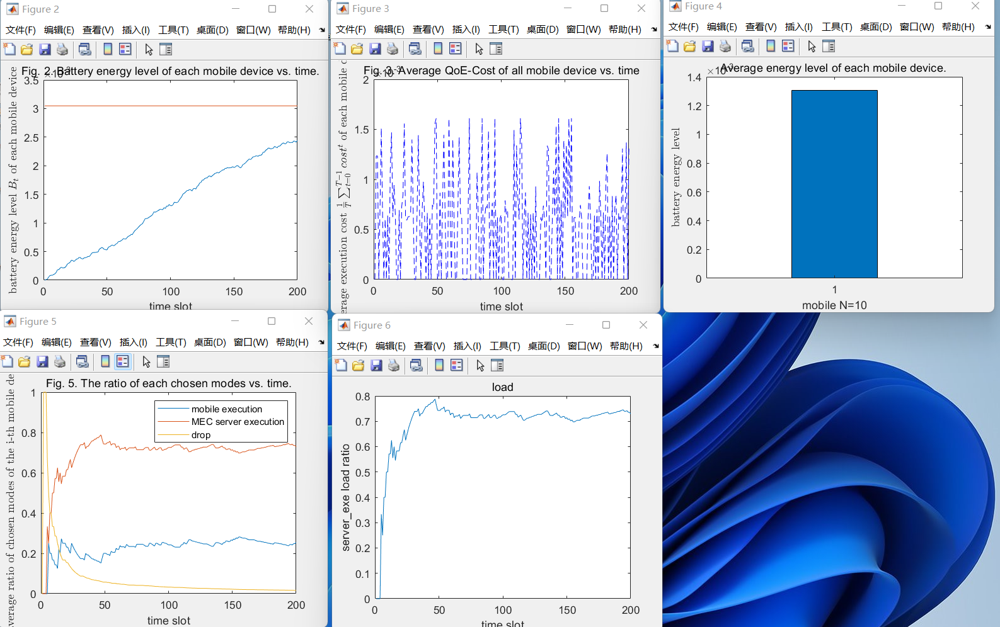

# 技术说明


## 1. 基本原理

计算卸载技术主要包括卸载决策、资源分配和卸载系统实现这三方面。
本项目研究为：卸载决策方案

### 1.1基于 Lyapunov 优化的动态卸载

基于 Lyapunov 优化的动态卸载算法，属于全部卸载思路，以降低时延为目标 

- 为了降低时延，优化目标包含了**执行时延**和**执行故障优化**两部分。

- 对这两个方面的优化，不仅能使任务时延最小化，还能保证故障率最低，降低了卸载失败的风险。

  

作者提出采用动态电压频率调整和功率控制的技术分别优化计算执行过程和计算卸载的数据传送。

- 一种基于 Lyapunov 优化的动态卸载（LODCO, low-complexity Lyapunov optimization based dynamic computation offloading）算法。

- LODCO 算法会在每个时隙中进行卸载决定，然后为 UE 分配 CPU 周期（在本地执行）或分配传输功率（卸载到 MEC），

-  结果表明能将运行时间缩短64%。

### 1.2 4 算法方案


|                                                              | fig2，fig3，fig4，fig5，fig6图像 | fig7，fig8图像                                               |
| ------------------------------------------------------------ | -------------------------------- | ------------------------------------------------------------ |
| LODCO 原生算法（单移动端，单服务端）                         | LODCO.m                          |                                                              |
| LODCO-Based eps-Greedy 算法-（贪心算法）                     | LODCO_based_e_Greedy.m           | LODCO_based_e_Greedy_fig7.m<br/>不存在fig8图像               |
| LODCO-Based Genetic Algorithm with Greedy Policy算法（遗传算法） | LODCO_Based_Genetic_Algorithm.m  | LODCO_Based_Genetic_Algorithm_fig7.m<br/>LODCO_Based_Genetic_Algorithm_fig8.m |


### 1.3 项目要求

完成论文中的fig2，fig3，fig4，fig5，fig6，fig7，fig8的图片以及代码。


### 1.4 系统初始条件（参考paper）

移动端 10 mobile devices 

服务端  5 MEC servers

能量使用下界 E_min = 0.02 mJ

服务端与移动端的相对距离：1 （unless stated, respectively. d  is exponentially distributed with mean 1）

最大距离：80米 （除非另有说明，我们假设随机移动和随机 MEC 服务器之间的最大距离为 80 m，这是均匀分布的上限。 ）

其他系统属性一般是固定的


### 1.5 控制变量

1、eps = 0.1; % 用于贪心算法的决策

```
 if rand() <= eps
 ...
 end
```


2、rho =0.7 。 以伯努利分布产生计算任务. 

```
参考paper：Bernoulli process [5], computation task  is requested  with probability  where 0< rho<1.

代码：
zeta = binornd(1, rho);
```


3、phi = 0.002;           请注意：仅仅允许在“遗传算法”中的控制变量(贪心算法中，不会影响P3 的cost函数)

phi = 0.002;                      % 任务丢弃的惩罚项权重(s)
little_phi = 0.002;               % 用小写的phi表示任务被卸载执行的奖励项

```
参考paper: 
if useKeyValuePair == false then
	 Use Genetic Algorithm to solve P_3
else
	Call the Key-value Pair Method.
end if
代码：
    %% 求解过程
    if useKeyValuePair == 0
        % 亦采用intlinprog求解        
        % 定义目标函数f
        goal = zeros(1,N*(M+2));
        for i = 1:10
            goal(7*i-6:7*i-5) = [local_execution_delay(t,i)-B_hat(t,i)*E_local(t,i),phi];
            goal(7*i-4:7*i) = J_s_matrix(i,:)-B_hat(t,i)*E_remote_matrix(i,:)-little_phi;
        end
        fitnessGoal = @(x)
    else
    	...
    end
```


### 1.6 实验算法

1、性能基准算法：LODCO-Based Greedy Algorithm

我们引入了一种基准算法，即基于 LODCO 的贪心算法，

它的工作原理如下： 在每个时隙，该算法总是在每个移动设备的本地执行和卸载执行之间选择P2目标值最小的模式，这意味着它不会考虑第二个优化目标； 否则，如果两者都不可行，则计算任务将被丢弃。 此外，该算法中的贪心策略与 Key-value Pair 方法具有相同的结构。 


2、实验函数：LODCO-Based Genetic Algorithm with Greedy Policy算法（遗传算法）


3、单纯的LODCO 的算法结果


### 1.7 基于遗传算法的贪心策略的LODCO的性能分析

#### 1.7.1 具体生成paper中fig2，fig3，fig4，fig5，fig6的图片。

运行时间片：T=200th

代码地址在``./LODCOBasedGeneticwithGreedyPolicy_yixiong/LODCOBasedGeneticwithGreedyPolicy.m``


控制变量情况：

```
基本情况（不修改）
N = 10;                           % 移动设备数目
M = 5;                            % MEC服务器个数
E_min = 0.02e-3;                  % 能量使用下界(J)
V = 1e-5;                         % LODCO中penalty项的权重(J^2/second)
E_H_max = 48e-6;                  % 收集的能量服从的均匀分布上限(J)
d0 = 1;                           % 服务器和移动设备之间的相对距离(m)
eps = 0.1;                        % 用于贪心算法的决策

可调整的变量情况（对比实验fig7中修改：max_distance；对比实验fig8中修改：phi和little_phi，rho）：
T = 200;                          % 时间片个数
rho = 0.7;                        % 计算任务抵达的概率
phi = 0.002;                      % 任务丢弃的惩罚项权重(s)
little_phi = 0.002;               % 用小写的phi表示任务被卸载执行的奖励项
max_distance = 80;      % 移动设备与MEC服务器之间的最远距离(米)
```


fig2


fig3


fig4


fig5


fig6


#### 1.7.2  具体生成paper中fig7的图片

运行时间片：T=50th （减少计算时间，150th太耗时间了）

代码地址在``./LODCOBasedGeneticwithGreedyPolicy_yixiong/LODCOBasedGeneticwithGreedyPolicy_fig7.m``

max_distance 距离取值：[50,80,100];其他不变

```
可调整的变量情况（对比实验fig7中修改：max_distance；对比实验fig8中修改：phi和little_phi，rho）：
T = 200;                          % 时间片个数
rho = 0.7;                        % 计算任务抵达的概率
phi = 0.002;                      % 任务丢弃的惩罚项权重(s)
little_phi = 0.002;               % 用小写的phi表示任务被卸载执行的奖励项
max_distance = 80;      % 移动设备与MEC服务器之间的最远距离(米)
```


#### 1.7.3  具体生成paper中fig8的图片


代码地址在``./LODCOBasedGeneticwithGreedyPolicy_yixiong/LODCOBasedGeneticwithGreedyPolicy_fig8.m``

```
可调整的变量情况（对比实验fig7中修改：max_distance；对比实验fig8中修改：phi和little_phi，rho）：
T = 200;                          % 时间片个数
rho = 0.7;                        % 计算任务抵达的概率
phi = 0.002;                      % 任务丢弃的惩罚项权重(s)
little_phi = 0.002;               % 用小写的phi表示任务被卸载执行的奖励项
max_distance = 80;      % 移动设备与MEC服务器之间的最远距离(米)
```


phi取值 [0.002,0.005,0.008]; 其他不变

rho取值 [0.4,0.7,0.9];其他不变

运行时间片：T=150th

与论文中的结论相符合


### 1.8 基准算法 LODCO-Based Greedy Algorithm


#### 1.7.1 具体生成paper中 fig5，fig6的图片。

运行时间片：T=200th

代码地址在``./LODCO_based_e_Greedy_yixiong/LODCO_based_e_Greedy.m``


```
基本情况（不修改）
N = 10;                           % 移动设备数目
M = 5;                            % MEC服务器个数
E_min = 0.02e-3;                  % 能量使用下界(J)
V = 1e-5;                         % LODCO中penalty项的权重(J^2/second)
E_H_max = 48e-6;                  % 收集的能量服从的均匀分布上限(J)
d0 = 1;                           % 服务器和移动设备之间的相对距离(m)
eps = 0.1;                        % 用于贪心算法的决策

可调整的变量情况（对比实验fig7中修改：max_distance ）：
T = 200;                          % 时间片个数
rho = 0.7;                        % 计算任务抵达的概率
phi = 0.002;                      % 任务丢弃的惩罚项权重(s)
little_phi = 0.002;               % 用小写的phi表示任务被卸载执行的奖励项
max_distance = 80;      % 移动设备与MEC服务器之间的最远距离(米)
```


fig5


fig6


#### 1.8.2   具体生成paper中fig7的图片


max_distance= [50,80,100];分别计算了50米，80米，100米，其他值不变的情况下

load的情况：    0.9263      0.8149      0.7201

代码地址在``./LODCO_based_e_Greedy_yixiong/LODCO_based_e_Greedy_fig7.m``


### 1.9 单纯的LODCO 的算法


运行时间片：T=200th

代码地址在``./LODCO_yixiong/LODCO.m``

```
基本情况（不修改）
N = 1;                           % 移动设备数目
M = 1;                            % MEC服务器个数
E_min = 0.02e-3;                  % 能量使用下界(J)
V = 1e-5;                         % LODCO中penalty项的权重(J^2/second)
E_H_max = 48e-6;                  % 收集的能量服从的均匀分布上限(J)
d = 50;                           % 服务器和移动设备之间的距离(m)
```


